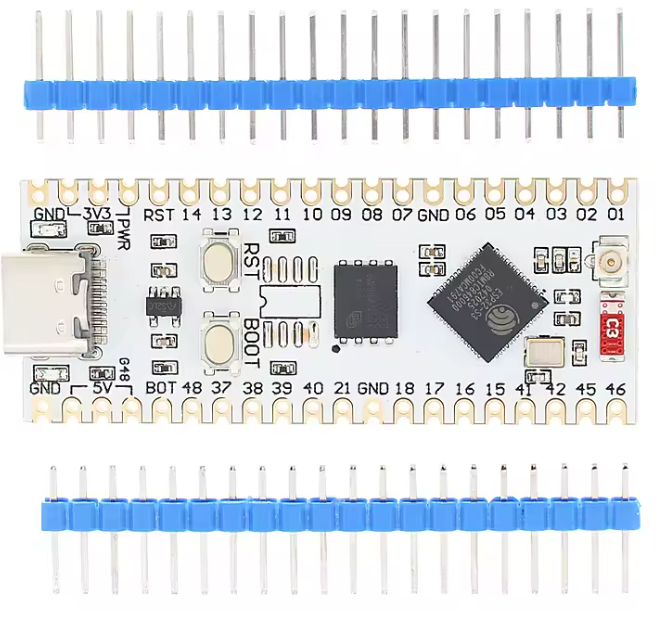
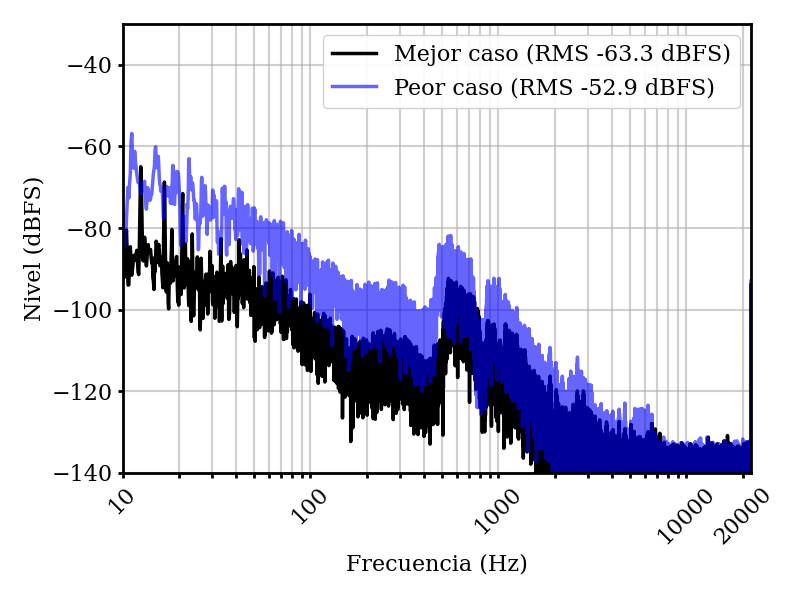

# GIAS ESP32-S3

Sistema autónomo de adquisición y grabación de audio basado en ESP32-S3.

## Mejoras implementadas

Se realizaron mejoras respecto de la versión anterior del sistema, principalmente en:

* Reducción del nivel de piso de ruido.
* Aumento de la autonomía del sistema.
* Mejora de la precisión de las marcas de tiempo de los archivos de audio.

## Placa electrónica

Se reemplazó la placa utilizada anteriormente por una nueva implementación basada directamente en el ESP32-S3, sin utilizar el módulo WROOM.

## Mitigación de ruido

Se implementaron distintas medidas para reducir el ruido presente en las grabaciones:

* Incorporación de un capacitor 104 de poliéster en la línea de alimentación del PMOD I2S2.
* Implementación de una jaula de Faraday sobre el ADC y su conexión con el microcontrolador.

## Mejora de autonomía

Se incorporó control de alimentación de los periféricos externos mediante MOSFETs IRF7303.

De esta manera, los periféricos reciben alimentación únicamente cuando son necesarios, reduciendo el consumo del sistema durante los períodos de reposo.

## Presentaciones

Este trabajo será presentado en:

* ADAA 2026.
* Sexto Congreso Virtual de Microcontroladores.
